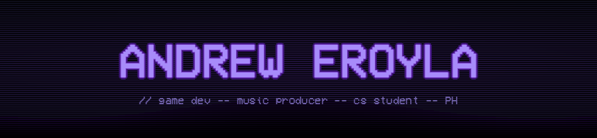
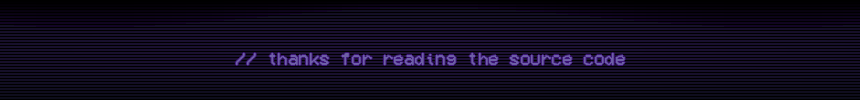

<!-- ═══════════════════════════════════════════════════════════ -->
<!--   ANDREW EROYLA — github profile readme                   -->
<!--   aesthetic: dark terminal · purple · monospace           -->
<!-- ═══════════════════════════════════════════════════════════ -->

<div align="center">



</div>

<div align="center">

[](https://git.io/typing-svg)

</div>

<div align="center">


&nbsp;

&nbsp;

&nbsp;


</div>

---

## `> whoami`

<div align="center">

```
  ┌─────────────────────────────────────────────────────────┐
  │                                                         │
  │    third-year cs student from the philippines           │
  │    i build games, write their music before they         │
  │    exist, and think in metaphors before systems.        │
  │                                                         │
  │    currently: deep in a capstone + a side project +     │
  │               a growing folder of half-done soundtracks │
  │                                                         │
  └─────────────────────────────────────────────────────────┘
```

</div>

---

## `> ls ./active-projects`

<div align="center">

| &nbsp; | PROJECT | STACK | STATUS |
|:---:|---|---|:---:|
| 🔋 | **WattzUp** — 3D first-person energy management sim | Unity · URP · C# |  |
| 🎨 | **Colorway** — daily color photo challenge PWA | Next.js 14 · Supabase · Vercel |  |
| 🎵 | **Original OSTs** — scores for imaginary worlds | BandLab · DAW |  |

</div>

---

## `> cat ./stack.sh`

<div align="center">


</div>

<div align="center">


</div>

---

## `> neofetch --stats`

<div align="center">


&nbsp;&nbsp;


</div>

<div align="center">


</div>

<div align="center">


</div>

---

## `> cat fun_fact.txt`

<div align="center">

```
  ┌─────────────────────────────────────────────────────────┐
  │                                                         │
  │    i produce full game soundtracks — atmospheric,       │
  │    layered, mixed — for games that haven't been         │
  │    built yet. the feeling has to exist before the       │
  │    world can be constructed around it.                  │
  │                                                         │
  │    whether that's the most backwards workflow in        │
  │    game dev or the only honest one, still deciding.     │
  │                                                         │
  └─────────────────────────────────────────────────────────┘
```

</div>

---

## `> contact --open`

<div align="center">

[](mailto:andreweroyla.offcl@gmail.com)
&nbsp;
[](https://github.com/aranxshx)

</div>

<div align="center">


</div>

---

<div align="center">



</div>
